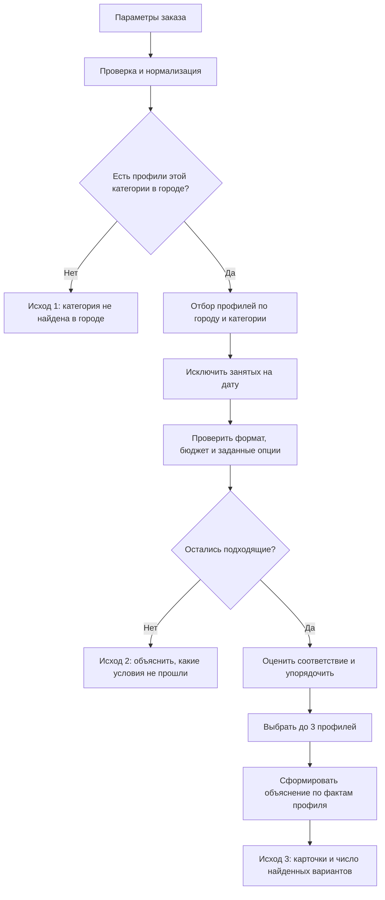

# Пайплайн подбора подрядчиков

Схема описывает ожидаемую логику продукта для демо. Это спецификация поведения, а не утверждение о том, как уже устроен код приложения.

## Диаграмма

## Шаги

1. **Принять запрос.** Обязательные поля: город, дата, формат мероприятия, категория и бюджет. Длительность и язык — дополнительные параметры.
2. **Проверить запрос.** Убедиться, что обязательные значения заданы и дата распознаётся. Привести значения к тем же справочным названиям, что используются в каталоге.
3. **Проверить наличие категории в городе.** Если ни один профиль этой категории не относится к выбранному городу, вернуть отдельный исход: «В этом городе такой категории нет».
4. **Собрать кандидатов.** Оставить профили нужной категории и города. Исключить занятых на выбранную дату: занятый профиль не может попасть в рекомендации.
5. **Проверить условия заказа.** Сопоставить формат и бюджет; если пользователь указал длительность или язык, проверить их тоже. Сохранять причины исключения, чтобы объяснить пустую выдачу. Не смешивать отсутствие категории с ситуацией, когда профили есть, но ни один не проходит условия.
6. **Ранжировать оставшихся кандидатов.** Сначала учитывать соответствие явным условиям; затем — релевантность описания запросу, если приложение использует смысловой поиск. Для стабильного порядка задать явное правило разрешения равенств, например по цене, затем по ID профиля.
7. **Вернуть не более трёх карточек.** Если подходящих профилей один или два, показать их фактическое число и объяснить, почему результатов меньше трёх. Не добавлять занятых или неподходящих ради заполнения списка.
8. **Объяснить каждую рекомендацию.** Использовать только проверяемые факты: город, цена относительно бюджета, формат, язык, длительность и конкретная релевантная деталь описания. Объяснения должны различаться между карточками.
9. **Пометить происхождение данных.** Если цена была проставлена при подготовке датасета или профиль синтетический, показать соответствующую пометку.

## Три исхода для пользователя

| Исход | Условие | Что показать |
|---|---|---|
| Подбор выполнен | Остался хотя бы один подходящий кандидат | До 3 карточек с индивидуальными объяснениями; если кандидатов меньше трёх — фактическое число и причина |
| Категории нет в городе | В каталоге нет профилей выбранной категории в выбранном городе | Явно сообщить об отсутствии категории в городе |
| Нет подходящих кандидатов | Категория в городе есть, но после проверки условий кандидатов не осталось | Объяснить причины: например, профили заняты на дату, превышают бюджет или не работают с выбранным форматом |

## Принципы для демонстрации

- Повтор одного и того же запроса должен давать тот же порядок карточек.
- Изменение даты должно менять результат, если меняется доступность; объяснение должно называть занятость причиной.
- Пустая выдача — полноценный ответ с причиной, а не пустой экран и не ошибка.
- Смысловой поиск может дополнять отбор и ранжирование, но не должен отменять жёсткие условия вроде города, даты и бюджета.
- Для объяснений использовать факты из профиля и результата фильтрации, а не общие рекламные фразы.
