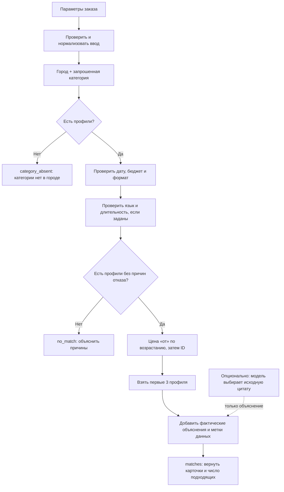

# Пайплайн подбора подрядчиков

Документ описывает фактическую логику Recommendation Engine в recommendation-logic: основной подбор детерминированный, без внешних API и без обязательной ИИ-модели. Вход можно заполнить вручную или через помощника описания события; после уточнения недостающих полей помощник передаёт подтверждённые параметры в тот же подбор.

## Диаграмма

## Этапы

1. **Получить условия заказа.** Обязательны город, дата, формат события, категория и бюджет. Язык и длительность необязательны. Альтернативный путь — описать событие помощнику; он задаёт вопросы о недостающих данных и просит подтвердить параметры перед тем же запросом к движку.
2. **Проверить и нормализовать поля.** Проверить типы и границы значений, дату в окне календаря 23.09–31.12.2026, положительный целочисленный бюджет. Город, формат, категория и язык сопоставляются без учёта регистра и повторных пробелов; написание в ответе берётся из каталога.
3. **Найти профили нужного города и категории.** Категории в CSV разделены символом |; у одного профиля может быть несколько категорий. Совпадение по одной запрошенной категории оставляет профиль одним кандидатом, а в карточке возвращается весь список его категорий. Если в городе нет профилей запрошенной категории, исход — category_absent.
4. **Применить обязательные условия.** Профиль исключается, если он занят на дату, цена «от» выше бюджета или формат события не указан в профиле.
5. **Проверить необязательные условия.** Если указан язык, он должен быть в языках профиля. Если указана длительность, профиль с max_hours ниже запроса исключается. max_hours = null не исключает профиль: это означает, что услуга не привязана к присутствию на площадке; сроки выполнения нужно согласовать.
6. **Объяснить отказ или сформировать выдачу.** Если кандидатов не осталось, вернуть no_match с причинами: занятость, бюджет, формат, длительность и/или язык. Профиль может не пройти несколько проверок; поэтому счётчики stats.rejected пересекаются и не суммируются в число людей. Если ни одна карточка не может быть показана из-за единственного нарушения, сообщение может назвать это нарушение отдельно; при пересекающихся причинах сервис сообщает о них как о пересекающихся.
7. **Упорядочить результаты.** Среди профилей, прошедших все условия, сортировка по цене «от» по возрастанию, затем по постоянному ID. Это детерминированный порядок цены, а не оценка качества и не семантический AI-рейтинг.
8. **Ограничить выдачу тремя карточками.** Взять первые три после сортировки. Сообщить число показанных и общее число подходящих; если профиль прошёл условия, но не вошёл в первые три, упомянуть, что остальные подходящие варианты не показаны из-за лимита карточек.
9. **Сформировать объяснения.** Правила выбирают полную отличительную фразу из описания профиля и связывают карточку с датой, форматом, городом, языком, ценой и (если задано) длительностью. Факты берутся из каталога; общие рекламные превосходные степени и незавершённые фразы не используются. Если отличительных подробностей нет, это обозначается явно. Цена всегда остаётся ценой «от», итоговую стоимость нужно уточнить.
10. **Показать метки происхождения.** В ответе API для карточки передаются все категории и флаги synthetic, city_imputed и price_imputed. Интерфейс должен показать флаги, а не выдавать проставленный город или цену за подтверждённый факт. Статус синтетического профиля не заменяет отдельные метки города и цены.

## Три пользовательских исхода

| Исход API | Когда возникает | Что объяснить |
|---|---|---|
| matches | Есть один или больше кандидатов, прошедших все условия | До 3 карточек, их отличительные факты, число всех подходящих вариантов и ограничение выдачи, если применимо |
| category_absent | В выбранном городе нет профиля с выбранной категорией | Категории нет в городе |
| no_match | Категория в городе есть, но никто не прошёл заданные условия | Конкретную причину или пересечение причин: занятость, бюджет, формат, язык, длительность |

## Опциональный ИИ в объяснениях

ИИ выключен по умолчанию. При отдельном включении он не ищет подрядчиков, не меняет фильтры, цены или порядок. Он выбирает индекс исходной фразы из описания уже отобранной карточки; сервер проверяет ID и индекс, затем сам формирует объяснение. Если модель недоступна или ответ некорректен, используются обычные объяснения. До проверки живого вызова нельзя утверждать, что ИИ улучшает качество подбора.

## Ключевые проверки

- Повтор запроса возвращает те же ID и порядок.
- Площадка, найденная по категории «Банкетный зал», отображает также категории «Загородная площадка» и «Ресторан», если они есть в профиле.
- Занятый профиль не возвращается, даже если он подходит по всем другим условиям.
- Профиль с max_hours = null не исключается только из-за запрошенной длительности.
- Синтетический профиль и проставленные при подготовке город/цена помечаются раздельно.
- Пустой ответ — успешный результат подбора с понятным сообщением, не техническая ошибка.
